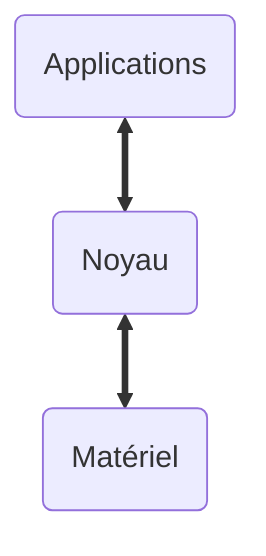
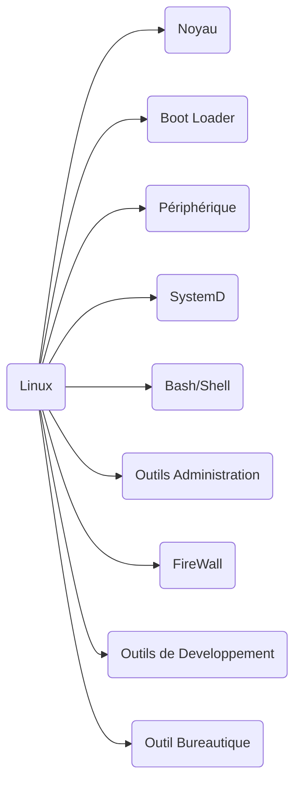

Noyaux Monolithiques Non Modulaire

## Distribution Linux :

> Trouver les logiciels qui ont les droits setuid : find / -perm -4000 2> /dev/null

Admin droits tous les privielges -> setuid  | SUDO -> Commande critique en cas de vulnérabilité.
#### - Appliquer le principe de Moindres Privilèges
LDAP : Light weight Directory Access Protocol -> 

OSI Protocol (pas disparu) : 
- X500 (protocol DAP)
- X509 Certificats Electronique

Kerberos -> Outil d'auth sur les serveurs LDAP
-> Protocol proposé par le MIT pour échangé des clés de façon symétrique dans les années 1980

