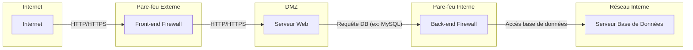

Dmz : Zone demilitarisé - Environement a part

```mermaid 
graph LR;
  subgraph Internet
        A[Internet]
    end

    subgraph "Pare-feu Externe"
        B[Front-end Firewall]
    end

    subgraph DMZ
        C[Serveur Web]
    end

    subgraph "Pare-feu Interne"
        F[Back-end Firewall]
    end

    subgraph "Réseau Interne"
        G[Serveur Base de Données]
    end

    A -->|HTTP/HTTPS| B
    B -->|HTTP/HTTPS| C
    C -->|"Requête DB (ex: MySQL)"| F
    F -->|Accès base de données| G
```

