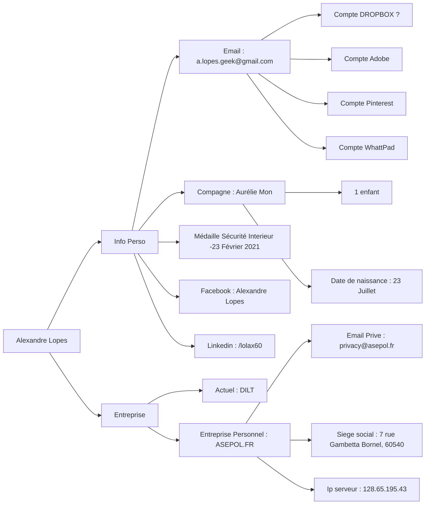

```mermaid 
graph LR 

A["Alexandre Lopes"] --> B["Info Perso"]
A --> C["Entreprise"]

B --> D["Email : a.lopes.geek@gmail.com"]
B --> H["Compagne : Aurélie Mon "]
H-->HA["1 enfant"]
B-->L["Médaille Sécurité Interieur -23 Février 2021"]
B-->M["Facebook : Alexandre Lopes"]
B-->N["Linkedin : /lolax60 "]

H --> J["Date de naissance : 23 Juillet"]

D-->DC["Compte DROPBOX ?"]
D-->DD["Compte Adobe"]
D-->DB["Compte Pinterest"]
D-->DJ["Compte WhattPad"]

C--> E["Actuel : DILT"]
C--> F["Entreprise Personnel : ASEPOL.FR"]

F--> O["Email Prive : privacy@asepol.fr"]
F-->P["Siege social : 7 rue Gambetta Bornel, 60540"]
F-->Q["Ip serveur : 128.65.195.43"]
```

