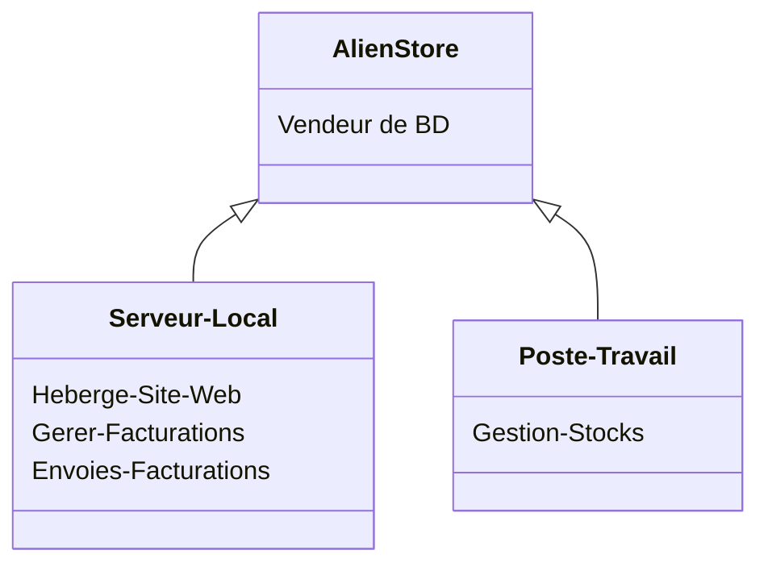

AlienStore est une entreprise qui vend des bandes dessinées à travers
le monde via son site web. Actuellement, le site est hébergé sur un
serveur local au sein de l’entreprise. Ce serveur gère également les
fichiers de facturation et la planification des envois. Cependant, le
serveur n’a pas les ressources nécessaires pour gérer ces différents
rôles efficacement. De plus, un poste de travail est utilisé pour la gestion
des stocks.

| Entreprise       | AlienStore                           |
| ---------------- | ------------------------------------ |
| Site Web         | Hebergement Serveur Local            |
| Serveur Local    | Gere les Facturations et les envoies |
| Poste de Travail | Gerer les stocks                     |

| Vulnérabilité | Menaces | Score |
| ------------- | ------- | ----- |
|               |         |       |
